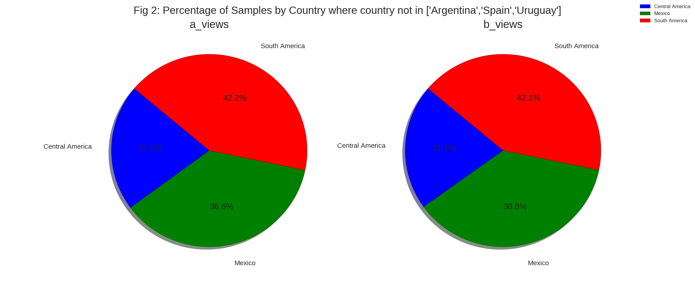
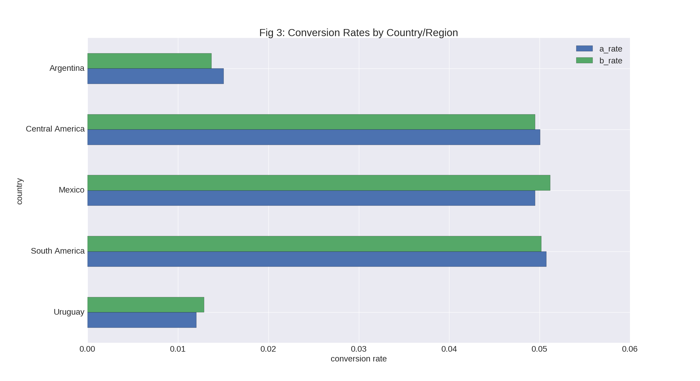

#Language Localization A/B Test Analysis

##Introduction
The marketing department finds that the standard Spanish version of the website works especially well for Spain.  This A/B test is designed to determine if localized Spanish improves response rates Central America, Mexico, and South America.  Initial results suggest that the localization is actually worse.

| Group        | views  | conversion | rate  |
|--------------|--------|------------|-------|
| Control    A | 237,338 | 13,096      | 0.055 |
| Experiment B | 215,983 | 9,379       | 0.043 |

Using all the data in the test, the calculated conversion rates for the control and experiment are 0.055 and .043 respectively.  However, looking at the data more closely, this difference is overstated by the fact that the Spain results are in the control group and not the experimental group thereby inflating the control results, and the large percentage of Argentinean samples in the B group is also overstating this difference.  Figure 1 illustrates this.  Argentina represents only 4% of the control group, but comprises 17% of the experiment.  Also, Spain should not be used, as its presence in the control is inflating the control numbers.
 
 

To demonstrate the effect of this imbalance, we remove Argentina and Spain.  The differences between control and experiment become smaller, but the control is still higher.  In practice, one would keep Argentina, but undersample the over-represented experiment group.

| Group        | views  | conversion | rate  |
|--------------|--------|------------|-------|
| Control    A | 176200 | 8827      | 0.050 |
| Experiment B | 178606 | 8866       | 0.049 |

Only at the aggregate level, is the original experiment balancing the sample size between control and experiment  With Spain and Argentina (for illustrative purposes)removed, one can see that the control and group samples have almost equal representation by country as seen in Figure 2:

The local translation versions tend to underperform in the majority of customer segments, but the differences are not significant.  However, gender differences were significant in Argentina.  Female Argentineans really did not like the local translation.  Their conversion rate fell from 1.76% to 1.4% (p-value .04  )whereas the male conversion rate stayed constant at 1.3%.  There may be some gender-related problems in the local translation that we would explore further.  

Figure 3 shows that the conversion rates for Argentina and Uruguay are low and are overrepresented in the overall conversion rate.

##Automated Algorithm. 

In doing an A/B test, the one input that we can control is the diversion of users to the A or B site.  We need to make sure that there is a balance between the numbers chosen for A or B over all customer segments.  The list below shows the feature importances in descending order created by a random forest classifier.  We choose to segment on the features that are most predictive of the classification.

>country_Argentina,
browser_language_ES,
browser_language_EN,
sex_F,
sex_M,
browser_Chrome,
browser_FireFox,
browser_IE,
ads_channel_Google,
country_Chile,
ads_channel_Facebook,
browser_language_Other,
ads_channel_Yahoo,
browser_Safari,
source_SEO,
country_Peru,
source_Direct,
source_Ads,
country_Venezuela,
ads_channel_Bing,
country_Colombia,
browser_Android_App,
country_Mexico,
browser_Iphone_App,
country_Guatemala,
country_El Salvador,
country_Ecuador,
browser_Opera,
country_Honduras,
country_Paraguay,
country_Bolivia,
country_Nicaragua,
country_Uruguay,
ads_channel_Other,
country_Costa Rica,
device_Web,
country_Panama,
device_Mobile

In order to test whether the samples are balanced, we can use chi-square contingency to see if we have the right number of samples in the control and experimental groups.  If our diversions are truly random, then the sample frequencies should not diverge too much from the expected values.  We chose to segment our samples by country, sex, browser_language, and browser, as they appear to be the most significant factors affecting the classification.  The algorithm is a contingency chi-square test on the sample frequencies.  It would report False whenever the p-value is less than .05 (our chosen confidence level)
  
The first test is run with all samples except for Spain:

Test Statistic: 17750.8520478,  p-value: 0.0,   Degrees of Freedom: 638

Samples are balanced:  **False**

Here we would reject the null hypothesis that the control and experimental groups have the same expected frequency values.  We would then manually investigate further what is causing this problem.  We next remove Argentina and Uruguay, and rerun the test to yield:

Test Statistic: 583.942909726,  p-value:  0.323166875362,  Degrees of Freedom: 569

Samples are balanced:  **True**

Now, we do not reject the null hypothesis, and conclude that the control and experimental frequency expectations are the same.   